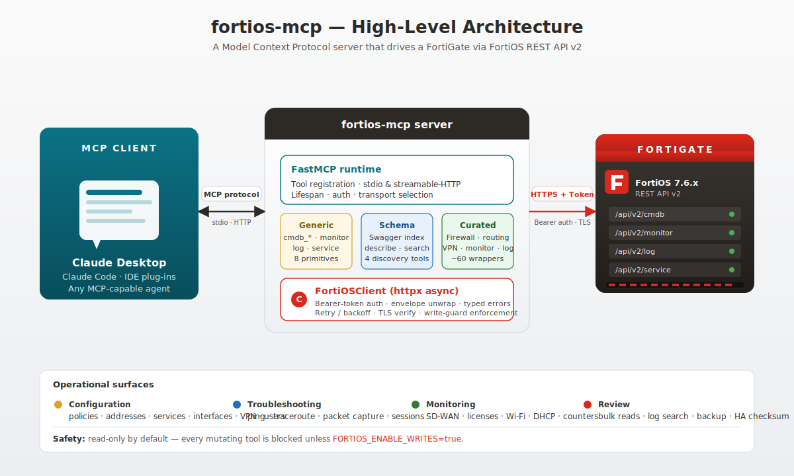

# Installation &amp; Usage Guide

This guide walks you through installing **fortios-mcp**, wiring it to a
FortiGate, and using it from the most common MCP clients.

The [quick-start section of the README](../README.md#quick-start) is the
five-minute version. Use this document when you want the long form — it
covers prerequisites, token creation (read-only *and* read-write), every
deployment mode (uv, pipx, Docker, systemd), TLS hardening for the HTTP
transport, VDOMs, the write-guard, troubleshooting, and upgrades.

---

## Table of contents

1. [Architecture at a glance](#architecture-at-a-glance)
2. [Prerequisites](#prerequisites)
3. [Downloading fortios-mcp](#downloading-fortios-mcp)
   - [git clone (source, recommended)](#git-clone-source-recommended)
   - [Release tarball / zip](#release-tarball--zip)
   - [Container image](#container-image)
   - [Python package (pipx / uv tool)](#python-package-pipx--uv-tool)
4. [Step 1 — Prepare the FortiGate](#step-1--prepare-the-fortigate)
5. [Step 2 — Install the server](#step-2--install-the-server)
   - [uv (recommended, local)](#uv-recommended-local)
   - [pipx (local, no venv mgmt)](#pipx-local-no-venv-mgmt)
   - [Docker / docker compose (HTTP)](#docker--docker-compose-http)
   - [systemd (long-running HTTP service)](#systemd-long-running-http-service)
6. [Step 3 — Configure environment variables](#step-3--configure-environment-variables)
7. [Step 4 — Connect an MCP client](#step-4--connect-an-mcp-client)
   - [Claude Desktop](#claude-desktop)
   - [Claude Code (CLI)](#claude-code-cli)
   - [Generic MCP client (HTTP)](#generic-mcp-client-http)
8. [Using the server](#using-the-server)
   - [First-run smoke test](#first-run-smoke-test)
   - [Read-only workflows](#read-only-workflows)
   - [Enabling writes safely](#enabling-writes-safely)
   - [VDOMs](#vdoms)
   - [Schema discovery for uncurated endpoints](#schema-discovery-for-uncurated-endpoints)
9. [TLS / transport hardening](#tls--transport-hardening)
10. [Upgrading](#upgrading)
    - [Fast upgrade — one-liners](#fast-upgrade--one-liners)
    - [Local (uv / pipx)](#local-uv--pipx)
    - [Docker](#docker)
    - [systemd](#systemd)
    - [Pinning a version](#pinning-a-version)
    - [Rollback](#rollback)
    - [FortiOS version bumps](#fortios-version-bumps)
11. [Troubleshooting](#troubleshooting)
12. [Uninstall](#uninstall)

---

## Architecture at a glance



One `fortios-mcp` instance talks to exactly one FortiGate. Run several
instances (one per device) if you manage a fleet.

---

## Prerequisites

| Requirement | Minimum | Notes |
|-------------|---------|-------|
| Python | 3.12 | Only required when running locally (uv / pipx). |
| `uv` | latest | Fastest install path. See https://github.com/astral-sh/uv |
| Docker | 24.x | Only for the container path. |
| FortiGate | FortiOS **7.6.6** | This is the only supported version. Bundled Swagger definitions and curated tools are validated against 7.6.6; other releases may work but are unsupported. |
| Network | Outbound HTTPS from the host to the FortiGate management IP on `FORTIOS_PORT` (default `443`). |
| MCP client | Claude Desktop, Claude Code, or any client that speaks MCP 2024-11 or later. |

---

## Downloading fortios-mcp

Pick the artifact that matches how you want to run the server. All
four sources publish the **same** version — the table below is just a
quick chooser.

| You want to … | Use this download |
|---------------|-------------------|
| Hack on the code, run via `uv` | [git clone](#git-clone-source-recommended) |
| Pin to a tagged release without git | [Release tarball / zip](#release-tarball--zip) |
| Run the HTTP transport in production | [Container image](#container-image) |
| Install the CLI globally on a workstation | [Python package](#python-package-pipx--uv-tool) |

### git clone (source, recommended)

```bash
git clone https://github.com/FreddyMcFett/fortios-mcp.git
cd fortios-mcp
```

To track a specific release instead of `main`:

```bash
git clone --branch v0.3.0 --depth 1 https://github.com/FreddyMcFett/fortios-mcp.git
```

### Release tarball / zip

Browse [GitHub Releases](https://github.com/FreddyMcFett/fortios-mcp/releases)
and grab `Source code (tar.gz)` or `(zip)`, or download the latest tag
straight from the CLI:

```bash
# Latest release (resolved via the GitHub redirect)
curl -L -o fortios-mcp.tar.gz \
  https://github.com/FreddyMcFett/fortios-mcp/archive/refs/heads/main.tar.gz

# A pinned tag
curl -L -o fortios-mcp-0.3.0.tar.gz \
  https://github.com/FreddyMcFett/fortios-mcp/archive/refs/tags/v0.3.0.tar.gz

tar -xzf fortios-mcp-0.3.0.tar.gz
cd fortios-mcp-0.3.0
```

### Container image

Pre-built multi-arch (amd64 + arm64) images are published to GHCR by
the release pipeline:

```bash
# Latest stable
docker pull ghcr.io/freddymcfett/fortios-mcp:latest

# Pin a major / minor / exact version
docker pull ghcr.io/freddymcfett/fortios-mcp:0
docker pull ghcr.io/freddymcfett/fortios-mcp:0.3
docker pull ghcr.io/freddymcfett/fortios-mcp:0.3.0
```

No git checkout is required to run the container — see
[Docker / docker compose](#docker--docker-compose-http) for the
runtime config. (`docker-compose.yml` and `.env.example` from the repo
are the easiest starting point if you do want a checkout.)

### Python package (pipx / uv tool)

Install the CLI globally without managing a virtualenv:

```bash
# pipx (any tag / branch by appending @ref)
pipx install git+https://github.com/FreddyMcFett/fortios-mcp.git
pipx install git+https://github.com/FreddyMcFett/fortios-mcp.git@v0.3.0

# or uv's tool installer
uv tool install git+https://github.com/FreddyMcFett/fortios-mcp.git
```

Both paths put a `fortios-mcp` executable on your `$PATH`.

---

## Step 1 — Prepare the FortiGate

The server authenticates with a **REST API admin token**. Create one
profile *per trust scope* — start read-only, and only add a read-write
profile once you're ready to turn writes on.

> Replace `<workstation-ip>` with the IP of the machine where
> `fortios-mcp` runs. The `trusthost` field is a hard allow-list
> enforced by FortiOS itself, so the token is useless from any other
> source address.

### Read-only profile &amp; token

```cli
config system accprofile
    edit "mcp_readonly"
        set scope global
        set sysgrp read
        set fwgrp read
        set netgrp read
        set vpngrp read
        set utmgrp read
        set loggrp read
    next
end

config system api-user
    edit "mcp_ro"
        set accprofile "mcp_readonly"
        set trusthost1 <workstation-ip>/32
    next
end

execute api-user generate-key mcp_ro
```

FortiOS prints the token once — copy it immediately, you cannot fetch
it again.

### Read-write profile &amp; token (optional, add later)

Only do this after validating the read-only setup end-to-end.

```cli
config system accprofile
    edit "mcp_readwrite"
        set scope global
        set sysgrp read-write
        set fwgrp read-write
        set netgrp read-write
        set vpngrp read-write
        set utmgrp read-write
        set loggrp read
    next
end

config system api-user
    edit "mcp_rw"
        set accprofile "mcp_readwrite"
        set trusthost1 <workstation-ip>/32
    next
end

execute api-user generate-key mcp_rw
```

### Verify the token

From the host that will run the server:

```bash
curl -sk -H "Authorization: Bearer <token>" \
  "https://<fortigate>/api/v2/monitor/system/status" | jq .http_status
# expected: 200
```

If you get `401`, double-check `trusthost`. If you get a TLS error on
self-signed certs, that's expected — you'll use `FORTIOS_VERIFY_SSL=false`
below. If you get `404`, the FortiOS build is too old for REST v2.

---

## Step 2 — Install the server

Pick **one** of the following. All paths work; the difference is how
you prefer to manage the Python process.

### uv (recommended, local)

Best for Claude Desktop / Claude Code on a laptop.

```bash
git clone https://github.com/FreddyMcFett/fortios-mcp.git
cd fortios-mcp
uv venv                       # creates .venv/
uv pip install -e .           # or: uv pip install .
uv run fortios-mcp --help     # sanity check
```

The entry-point script `fortios-mcp` is now available via
`uv run fortios-mcp` inside this directory.

### pipx (local, no venv mgmt)

```bash
pipx install git+https://github.com/FreddyMcFett/fortios-mcp.git
fortios-mcp --help
```

### Docker / docker compose (HTTP)

Use this when you want a persistent HTTP endpoint (e.g. shared for a
team, fronted by a reverse proxy, or running on a jump host).

```bash
git clone https://github.com/FreddyMcFett/fortios-mcp.git
cd fortios-mcp
cp .env.example .env
$EDITOR .env                  # fill in FORTIOS_HOST + FORTIOS_API_TOKEN
chmod 600 .env
docker compose up -d
docker compose logs -f        # watch it connect
```

The endpoint is `http://localhost:8002/` by default. See
[TLS / transport hardening](#tls--transport-hardening) before exposing
it beyond localhost.

Pull the published image directly if you don't need to build:

```bash
docker pull ghcr.io/freddymcfett/fortios-mcp:latest
```

Images are tagged `latest`, `{major}`, `{major}.{minor}`, and
`{version}` — pin a tag in production.

### systemd (long-running HTTP service)

For a bare-metal HTTP deployment:

```ini
# /etc/systemd/system/fortios-mcp.service
[Unit]
Description=FortiOS MCP server
After=network-online.target
Wants=network-online.target

[Service]
Type=simple
User=fortiosmcp
WorkingDirectory=/opt/fortios-mcp
EnvironmentFile=/etc/fortios-mcp.env
ExecStart=/opt/fortios-mcp/.venv/bin/fortios-mcp
Restart=on-failure
RestartSec=5

[Install]
WantedBy=multi-user.target
```

`/etc/fortios-mcp.env` must be `chmod 600` and owned by `fortiosmcp`.

```bash
sudo systemctl daemon-reload
sudo systemctl enable --now fortios-mcp
sudo systemctl status fortios-mcp
```

---

## Step 3 — Configure environment variables

All settings are env-vars. The full reference is in
[`.env.example`](../.env.example); a quick decision matrix follows.

| Variable | Typical value | When to change |
|----------|---------------|----------------|
| `FORTIOS_HOST` | `fgt.example.com` | Always — required. |
| `FORTIOS_PORT` | `443` | Non-standard admin port. |
| `FORTIOS_API_TOKEN` | `xxxxxxxx` | Always — required. |
| `FORTIOS_VERIFY_SSL` | `true` | `false` **only** for a lab FortiGate with a self-signed cert. |
| `FORTIOS_TIMEOUT` | `30` | Raise for slow WAN links or large log queries. |
| `FORTIOS_MAX_RETRIES` | `3` | Raise on flaky links; lower for snappier failure. |
| `FORTIOS_DEFAULT_VDOM` | `root` | Set to your operating VDOM on multi-VDOM boxes. |
| `FORTIOS_ENABLE_WRITES` | `false` | `true` **only** when you want mutating tools live. |
| `FORTIOS_TOOL_MODE` | `full` | `dynamic` registers only the 12 discovery/generic tools — useful if you hit per-client tool limits. |
| `MCP_SERVER_MODE` | `auto` | `stdio` for Claude Desktop-style clients, `http` for Docker. `auto` picks based on TTY. |
| `MCP_SERVER_HOST` | `0.0.0.0` | Bind address (HTTP mode). |
| `MCP_SERVER_PORT` | `8002` | HTTP port. |
| `MCP_AUTH_TOKEN` | unset | **Set to a strong secret whenever the HTTP endpoint is reachable off-host.** |
| `MCP_ALLOWED_HOSTS` | unset | Comma-separated list of `Host:` values accepted on the HTTP endpoint; protects against DNS rebinding. |
| `LOG_LEVEL` | `INFO` | `DEBUG` when diagnosing; tokens are redacted automatically. |
| `LOG_FILE` | unset | Path to mirror logs to disk. |

`.env` files must be `chmod 600`; `utils/config.py` emits a warning
otherwise.

---

## Step 4 — Connect an MCP client

### Claude Desktop

Edit `claude_desktop_config.json`:

- macOS: `~/Library/Application Support/Claude/claude_desktop_config.json`
- Windows: `%APPDATA%\Claude\claude_desktop_config.json`
- Linux: `~/.config/Claude/claude_desktop_config.json`

```json
{
  "mcpServers": {
    "fortios": {
      "command": "uv",
      "args": ["run", "--directory", "/absolute/path/to/fortios-mcp", "fortios-mcp"],
      "env": {
        "FORTIOS_HOST": "fgt.example.com",
        "FORTIOS_API_TOKEN": "xxxxxxxxxxxx",
        "FORTIOS_VERIFY_SSL": "false",
        "FORTIOS_DEFAULT_VDOM": "root"
      }
    }
  }
}
```

Restart Claude Desktop, open a new chat, and you should see `fortios`
listed in the MCP servers panel.

### Claude Code (CLI)

Register the server in your project (or user-level) MCP config — for
example `.claude/mcp.json`:

```json
{
  "mcpServers": {
    "fortios": {
      "command": "uv",
      "args": ["run", "fortios-mcp"],
      "env": {
        "FORTIOS_HOST": "fgt.example.com",
        "FORTIOS_API_TOKEN": "xxxxxxxxxxxx"
      }
    }
  }
}
```

Then, inside the project directory:

```bash
claude mcp list          # confirm fortios is listed
claude                   # start a session; tools appear automatically
```

### Generic MCP client (HTTP)

When running under Docker / systemd the server exposes an MCP
streamable HTTP endpoint:

```
POST http://<host>:8002/
Authorization: Bearer <MCP_AUTH_TOKEN>
```

Any MCP client that supports HTTP transport (LangGraph, LlamaIndex,
custom SDK) can target this URL. Use a TLS-terminating proxy (Caddy,
Nginx, Traefik) for anything beyond localhost.

---

## Using the server

### First-run smoke test

Ask the model:

> Use the fortios server to get the system status.

It should call `get_system_status` and return hostname, version,
serial, uptime, etc. If that works, the token and network path are
good.

### Read-only workflows

Everything that doesn't modify the FortiGate works out of the box.
Some high-value prompts to try:

- *"List all firewall policies on `root`, show source, destination,
  service and action."* → `list_firewall_policies`
- *"Which interfaces are admin-up but link-down?"* → `get_interface_status`
- *"Ping `8.8.8.8` from the FortiGate and report loss."* → `ping`
- *"Search the traffic log for drops to 10.0.0.0/8 in the last hour."*
  → `log_search_memory` or `log_search_disk`
- *"Summarize SD-WAN link health."* → `get_sdwan_health`

### Enabling writes safely

1. Generate a **separate** read-write token (see
   [Step 1](#step-1--prepare-the-fortigate)).
2. Set `FORTIOS_API_TOKEN` to the RW token **and**
   `FORTIOS_ENABLE_WRITES=true`.
3. Restart the server (or the Docker container / systemd unit).
4. Keep the window of time writes are enabled short — flip back to the
   read-only token when you're done.

Write-guarded tools return a clear error when `FORTIOS_ENABLE_WRITES`
is `false`, so nothing silently no-ops.

> **Tip:** Even with writes enabled, ask the model to *describe* the
> change first (e.g. show the JSON body it plans to POST) and explicitly
> approve before it calls a mutating tool.

### VDOMs

Every tool that accepts a `vdom` argument defaults to
`FORTIOS_DEFAULT_VDOM`. Override per-call by passing the VDOM name
explicitly. For a multi-VDOM box, set `FORTIOS_DEFAULT_VDOM` to the
VDOM you operate in most often.

### Schema discovery for uncurated endpoints

The ~88 curated tools cover the common cases, but FortiOS exposes
several thousand endpoints. When the model needs one that isn't
wrapped, it uses the four schema-discovery tools:

1. `list_api_categories` — lists the 81 api-doc categories bundled in
   `api-docs/`.
2. `list_endpoints` — lists every path in a category.
3. `search_endpoints` — keyword search across every path.
4. `describe_endpoint` — returns the full Swagger definition
   (parameters, request/response schema, allowed methods) for one
   path.

The model then calls the matching generic primitive (`cmdb_get`,
`monitor_get`, etc.) with the right path and parameters.

---

## TLS / transport hardening

For the **stdio** transport (Claude Desktop / Claude Code), the MCP
channel is local pipes — no additional TLS is needed. You still want
`FORTIOS_VERIFY_SSL=true` in front of the FortiGate, which means the
FortiGate needs a valid certificate (see FortiOS `config system
certificate`). Only disable verification for lab devices.

For the **HTTP** transport:

- Set `MCP_AUTH_TOKEN` to a strong random value. The server rejects
  requests without it.
- Put a TLS-terminating reverse proxy in front of the container. Do
  **not** expose port 8002 directly to untrusted networks.
- Set `MCP_ALLOWED_HOSTS` to the exact hostnames clients use; this
  rejects DNS-rebinding attacks.
- Rotate `FORTIOS_API_TOKEN` on the FortiGate periodically —
  `execute api-user generate-key mcp_ro` invalidates the previous
  token.

---

## Upgrading

Releases are cut by `python-semantic-release` on every merge to
`main`. Each tag publishes a GHCR image and a GitHub release in
parallel, so all install paths reach the new version within a couple
of minutes of the tag landing.

### Fast upgrade — one-liners

Run the line that matches your install. These are the "I just want the
latest version" shortcuts; the per-installer sections below have the
detail (pinning, rollback, restart commands).

```bash
# uv (cloned source)        — pull main + reinstall in-place
cd fortios-mcp && git pull --ff-only && uv pip install -e . --upgrade

# pipx                      — re-resolve from the same git source
pipx upgrade fortios-mcp

# uv tool                   — same idea
uv tool upgrade fortios-mcp

# Docker compose            — pull new image and restart only what changed
docker compose pull && docker compose up -d

# Plain Docker run          — pull + restart the container by name
docker pull ghcr.io/freddymcfett/fortios-mcp:latest \
  && docker restart fortios-mcp

# systemd                   — git pull + reinstall + restart unit
sudo -u fortiosmcp git -C /opt/fortios-mcp pull --ff-only \
  && sudo -u fortiosmcp /opt/fortios-mcp/.venv/bin/pip install -U /opt/fortios-mcp \
  && sudo systemctl restart fortios-mcp
```

> Restart your MCP **client** too (Claude Desktop / Claude Code) when
> using the stdio transport — it spawns the server subprocess, so a
> client restart is what actually picks up the new code.

### Local (uv / pipx)

```bash
# uv (editable checkout)
cd fortios-mcp
git pull --ff-only
uv pip install -e . --upgrade

# pipx — track main
pipx upgrade fortios-mcp

# pipx — jump to a specific tag
pipx install --force git+https://github.com/FreddyMcFett/fortios-mcp.git@v0.3.1
```

`--ff-only` keeps the upgrade safe: if you have local commits the pull
fails loudly instead of merging.

### Docker

```bash
docker compose pull        # downloads the new image layer(s)
docker compose up -d       # recreates only containers whose image changed
docker image prune -f      # optional — drop the now-dangling old image
```

Health check after the bounce:

```bash
docker compose logs --tail 50 -f
curl -fsS -H "Authorization: Bearer $MCP_AUTH_TOKEN" \
  http://localhost:8002/  >/dev/null && echo OK
```

### systemd

```bash
sudo -u fortiosmcp git -C /opt/fortios-mcp pull --ff-only
sudo -u fortiosmcp /opt/fortios-mcp/.venv/bin/pip install -U /opt/fortios-mcp
sudo systemctl restart fortios-mcp
sudo systemctl status fortios-mcp --no-pager
```

### Pinning a version

`latest` follows `main`. For predictable upgrades pin a tag:

| Tag | Tracks |
|-----|--------|
| `ghcr.io/freddymcfett/fortios-mcp:0` | latest `0.x.y` |
| `ghcr.io/freddymcfett/fortios-mcp:0.3` | latest `0.3.x` (recommended for prod) |
| `ghcr.io/freddymcfett/fortios-mcp:0.3.1` | exact build |
| `ghcr.io/freddymcfett/fortios-mcp:latest` | every merge to `main` |

For pipx / uv tool, append `@vX.Y.Z` to the git URL when installing.

### Rollback

If a new version misbehaves, drop back to the previous one. The
write-guard means a rollback can never *cause* a config change on the
FortiGate.

```bash
# Docker — re-pin to the previous tag and bounce
docker compose pull ghcr.io/freddymcfett/fortios-mcp:0.3.0
docker compose up -d

# uv (cloned source)
cd fortios-mcp && git checkout v0.3.0 && uv pip install -e . --upgrade

# pipx
pipx install --force git+https://github.com/FreddyMcFett/fortios-mcp.git@v0.3.0
```

Tag history lives in [GitHub Releases](https://github.com/FreddyMcFett/fortios-mcp/releases)
and matches the entries in [`CHANGELOG.md`](../CHANGELOG.md).

### FortiOS version bumps

When Fortinet releases a new FortiOS minor (e.g. 7.6.7 → 7.8.0), the
server usually keeps working via schema discovery. New ergonomic
wrappers arrive in the next release — check
[`CHANGELOG.md`](../CHANGELOG.md). The bundled `api-docs/` is
regenerated per FortiOS release; see
[`CLAUDE.md` §11](../CLAUDE.md#11-updating-for-a-new-fortios-release).

---

## Troubleshooting

| Symptom | Likely cause | Fix |
|---------|--------------|-----|
| `AuthenticationError` on first call | Wrong `FORTIOS_API_TOKEN` or source IP not in `trusthost` | Re-check the token and `trusthost1` on the api-user. |
| `ssl.SSLCertVerificationError` | Self-signed FortiGate cert | Set `FORTIOS_VERIFY_SSL=false` (lab only) or install a trusted cert on the FortiGate. |
| Tool call returns `"writes are disabled"` | Write-guard blocking a mutating tool | Set `FORTIOS_ENABLE_WRITES=true` and restart. |
| `NotFoundError` on a valid-looking path | VDOM mismatch | Pass `vdom=` explicitly or set `FORTIOS_DEFAULT_VDOM`. |
| Claude Desktop shows no `fortios` server | `command` / `args` / `cwd` wrong in `claude_desktop_config.json` | Use an **absolute** path, and check the Claude Desktop MCP log file. |
| HTTP endpoint returns `401` | `MCP_AUTH_TOKEN` set but client not sending it | Add `Authorization: Bearer <token>` header. |
| Connection hangs | Firewall in front of FortiGate blocking port 443 | Verify reachability with `curl` first. |

Turn on `LOG_LEVEL=DEBUG` for per-request traces; all tokens,
passwords, and PSKs are redacted by `sanitize_for_logging()` before
anything hits the log.

---

## Uninstall

```bash
# uv / pipx
pipx uninstall fortios-mcp
# or just delete the cloned repo and its .venv

# Docker
docker compose down
docker image rm ghcr.io/freddymcfett/fortios-mcp:latest

# FortiGate (revoke the tokens you created)
config system api-user
    delete mcp_ro
    delete mcp_rw
end
```
